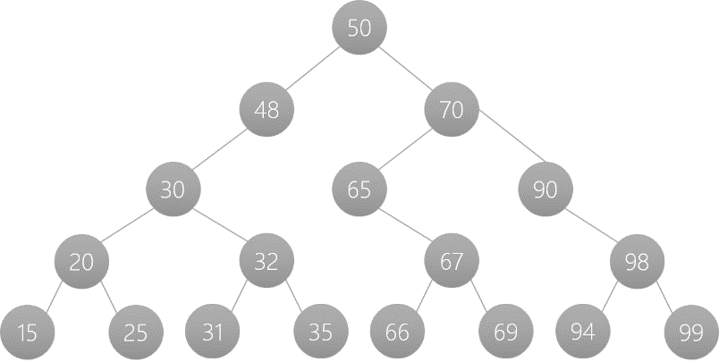

# DS PT2 QB

### Q1. What is Depth in a tree data structure?
**A1:** 
- The depth of a node is the number of edges from the root node to that particular node.
- The root node has a depth of 0, and as you move down the tree, the depth increases by 1 for each level.

### Q2. What is Height in a tree data structure?
**A2:**
- The height of a node is the number of edges on the longest path from that node to a leaf.
- For the entire tree, the height is the height of the root node.
- A leaf node has a height of 0.

### Q3. What are Internal Nodes in a tree?
**A3:**
- Internal nodes are the nodes in a tree that have at least one child.


### Q4. What is a Leaf in a tree data structure?
**A4:**
- A leaf (or leaf node) is a node that has no children.
- It is the last node in a path from the root, with no further nodes to expand into.

### Q5. Explain different cases for deletion of a node in binary search tree. Write function for each case.
**A5:** 
```c
    struct Node* delNode(struct Node* root, int x) {
        if (root == NULL)
            return root;
        if (root->val > x)
            root->left = delNode(root->left, x);
        else if (root->val < x)
            root->right = delNode(root->right, x);
        else {
            if (root->left == NULL) {        // Case 1: Node has no left child (or is a leaf node)
                struct Node* temp = root->right;
                free(root);
                return temp;
            }
            if (root->right == NULL) {       // Case 2: Node has no right child
                struct Node* temp = root->left;
                free(root);
                return temp;
            }
            struct Node* succ = root->right; // Case 3: Node has two children
            while (succ->left != NULL) 
                succ = succ->left;
            root->val = succ->val;
            root->right = delNode(root->right, succ->val);
        }
        return root;
}
```
### Q6. For the following BST, show preorder, inorder and postorder traversal. (any graph can be given)

**A6:** 
#### Inorder:
15, 20, 25, 30, 31, 32, 35, 48, 50, 65, 66, 67, 69, 70, 90, 94, 98, 99
#### Preorder:
50, 48, 30, 20, 15, 25, 32, 31, 35, 65, 70, 67, 66, 69, 90, 98, 94, 99
#### Postorder:
15, 25, 20, 31, 35, 32, 30, 48, 66, 69, 67, 65, 94, 99, 98, 90, 70, 50

### Q7. Implement following functions in C for Binary Search Tree
**A7:**
Insertion:
```c
#include <stdlib.h>
struct Node {
    int val;
    struct Node* left;
    struct Node* right;
};
struct Node* createNode(int value) {
    struct Node* newNode = (struct Node*)malloc(sizeof(struct Node));
    newNode->val = value;
    newNode->left = NULL;
    newNode->right = NULL;
    return newNode;
}
struct Node* insert(struct Node* root, int value) {
    if (root == NULL) {
        return createNode(value);
    }
    if (value < root->val) {
        root->left = insert(root->left, value);
    } else if (value > root->val) {
        root->right = insert(root->right, value);
    }    
    return root;
}
```
Total number of nodes
```c
struct Node {
    int val;
    struct Node* left;
    struct Node* right;
};
int countNodes(struct Node* root) {
    if (root == NULL) {
        return 0;
    }    
    return 1 + countNodes(root->left) + countNodes(root->right);
}
```
Number of leaf nodes 
```c
int countLeafNodes(struct Node* root) {
    if (root == NULL) {
        return 0;
    }    
    if (root->left == NULL && root->right == NULL) {
        return 1;
    }    
    return countLeafNodes(root->left) + countLeafNodes(root->right);
}
```
Smallest Element
```c
struct Node {
    int val;
    struct Node* left;
    struct Node* right;
};
struct Node* findMin(struct Node* root) {
    if (root == NULL) {
        return NULL;
    }    
    while (root->left != NULL) {
        root = root->left;
    }    
    return root; 
}
```

### Q8. For the following traversals construct Binary Search Tree
**A8:**

Postorder : 20 40 55 63 65 60 50
```
            50
           /  \
         40    60
        /     /  \
       20    55   65
                 /
               63
```

Preorder : 55 45 40 48 60 58 65 63

```
        55
       /  \
     45    60
    /  \   / \
   40  48 58  65
             /
           63
```

### Q9. Write a short note on binary tree and its type.
**A9:**
A binary tree is a data structure in which each node has at most two children, referred to as the left child and the right child. The topmost node in a binary tree is called the **root**, and the bottom-most nodes are called **leaves**. A binary tree can be visualized as a hierarchical structure with the root at the top and the leaves at the bottom.

### Terminologies in Binary Tree

- **Nodes**: The fundamental part of a binary tree, where each node contains data and links to two child nodes.
  
- **Root**: The topmost node in a tree. It has no parent and serves as the starting point for all nodes in the tree.
  
- **Parent Node**: A node that has one or more child nodes. In a binary tree, each node can have at most two children.
  
- **Child Node**: A node that is a descendant of another node (its parent).
  
- **Leaf Node**: A node that does not have any children or has both children as null.
  
- **Internal Node**: A node that has at least one child. This includes all nodes except the root and the leaf nodes.
  
- **Depth of a Node**: The number of edges from a specific node to the root node. The depth of the root node is zero.
  
- **Height of a Binary Tree**: The number of nodes from the deepest leaf node to the root node.


# Types of Binary Trees

Binary trees can be classified into several types based on their structure and properties. Here are some of the common types:

## 1. Full Binary Tree
- **Definition**: A binary tree in which every node other than the leaves has exactly two children.
- **Characteristics**: 
  - All levels are completely filled except possibly for the last level.
  
## 2. Complete Binary Tree
- **Definition**: A binary tree in which all levels are fully filled, except possibly for the last level, which is filled from left to right.
- **Characteristics**: 
  - The last level does not have any gaps.

## 3. Perfect Binary Tree
- **Definition**: A binary tree in which all internal nodes have two children and all leaf nodes are at the same level.
- **Characteristics**: 
  - All levels are completely filled.

## 4. Balanced Binary Tree
- **Definition**: A binary tree where the height of the left and right subtrees of any node differs by no more than one.
- **Characteristics**: 
  - Ensures that the tree remains approximately balanced for efficient operations.

## 5. Degenerate (or pathological) Tree
- **Definition**: A binary tree in which each parent node has only one child. This structure essentially behaves like a linked list.
- **Characteristics**: 
  - Each node has either zero or one child, resulting in poor performance for operations like search, insert, and delete.

## 6. Binary Search Tree (BST)
- **Definition**: A binary tree where the left child contains only nodes with values less than the parent node, and the right child only contains nodes with values greater than the parent node.
- **Characteristics**: 
  - Allows for efficient searching, insertion, and deletion operations.

## 7. AVL Tree // Optional
- **Definition**: A self-balancing binary search tree where the heights of the two child subtrees of any node differ by no more than one.
- **Characteristics**: 
  - Ensures O(log n) time complexity for search, insert, and delete operations.


